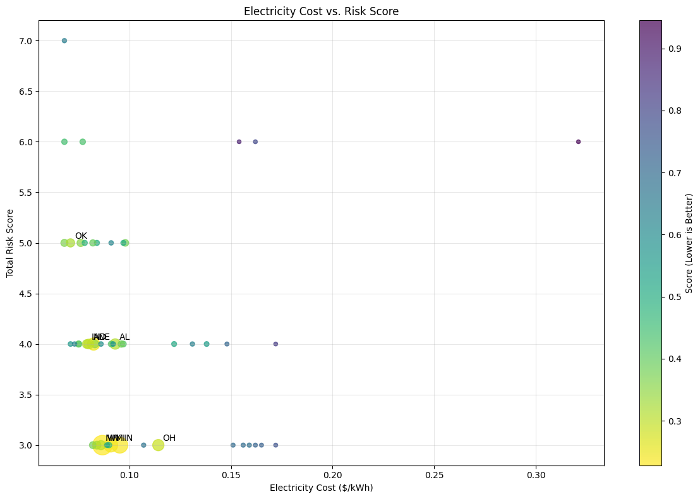

# Geospatial Multi-Criteria Analysis for Data Center Placement

A decision-support framework that ranks U.S. states as candidate locations for a data center by combining multiple siting factors — energy cost, natural-disaster risk, cooling climate, network connectivity, tax incentives, land price, and security — into a single weighted score, then visualizing the results on interactive maps.

> **Data disclosure:** The input factor values in this project are **synthetic / illustrative**, not live feeds from external APIs. The notebook implements the full scoring and mapping pipeline on hardcoded demonstration data so the methodology can be shown end to end. The state rankings below are therefore illustrative of the **method**, not a real-world siting recommendation.

---

## What it does

- Assembles a per-state dataset across nine siting factors (see below)
- Stores the data in a local **SQLite** database and loads it back as **GeoDataFrames**
- Computes three intermediate sub-scores — **risk**, **cost**, and **connectivity** — then combines them into a final weighted **optimization score** per state
- Ranks all 50 states and categorizes them by risk level
- Produces interactive **Folium** and **Plotly** maps and ranking charts (choropleths, scatter plots, a "what-if" scenario view)

### Factors considered

Electricity/industrial power rates · flood risk · seismic hazard · hurricane exposure · cooling climate · fiber & internet-exchange (IXP) connectivity · tax incentives · land prices · crime/security.

---

## Illustrative output

*States ranked by composite siting score on the demonstration data (Wyoming, Indiana, Michigan, Nebraska, Ohio lead; lower score = more favorable). These rankings reflect the scoring logic applied to **synthetic inputs** and are not an actual siting recommendation.*

---

## Tech stack

| Layer | Tools |
| --- | --- |
| Language | Python 3 |
| Geospatial | GeoPandas, Shapely, pyproj |
| Data / storage | pandas, NumPy, SQLAlchemy + SQLite |
| Visualization | Folium, Plotly, matplotlib |

---

## Methodology

The pipeline separates concerns into clean stages:

- **Collection** — a `DataCollector` class assembles each factor into a per-state table and writes it to SQLite.
- **Spatial load** — tables with coordinates are converted to GeoDataFrames (`EPSG:4326`) for mapping.
- **Scoring** — factors are normalized and combined into risk, cost, and connectivity sub-scores, then weighted into a final score.
- **Visualization** — results are rendered as interactive maps and ranking charts, plus a "what-if" scenario that re-weights factors.

The value of the project is the **framework**: a reproducible way to turn many heterogeneous siting factors into a single comparable score with geographic visualization. Swapping the synthetic inputs for real API feeds (EIA for power prices, FEMA/USGS/NOAA for hazard data, Census for land/economic data) would make the output actionable.

---

## Data & limitations

- **Synthetic inputs.** Factor values are hardcoded demonstration data, not live API pulls. Rankings illustrate the method only.
- **State-level granularity.** Real siting decisions happen at the site/county level with power-substation, fiber-route, and parcel detail — a state-level score is a coarse first filter at best.
- **Static weights.** The composite weighting is fixed (with one what-if variant); a production tool would let users tune weights to their priorities.
- **No validation.** Because inputs are synthetic, the rankings are not validated against real data center siting outcomes.

---

## How to run

1. Open the notebook in Google Colab (or Jupyter).
2. Run the first cell to install geospatial dependencies (`geopandas`, `folium`, `plotly`, `sqlalchemy`, `shapely`, etc.).
3. Run cells top to bottom. The notebook builds the SQLite database, computes scores, and writes interactive `.html` maps to a local `visualizations/` folder as well as rendering charts inline.

No API keys are required (inputs are synthetic).
